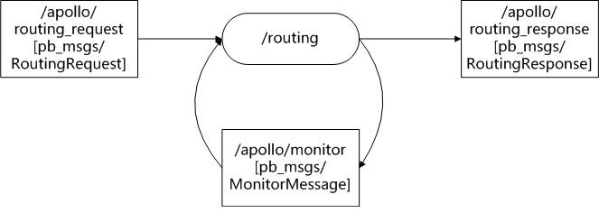

# routing模块分析
## 功能：
基于请求，输出两点之间导航信息。
## 输入：
 * 用户的起始和终止位置。/apollo/routing_request[pb_msgs/RoutingRequest]。
 * HD map。
 * /apollo/monitor[pb_msgs/MonitorMessage]。

## 输出：
 * 请求的响应：/apollo/routing_response[pb_msgs/RoutingResponse],包含了最终的路由信息。
 * /apollo/monitor[pb_msgs/MonitorMessage]。

## 节点I/O：

## routing源码：
### routing.cc和routing.h
 * Name()函数：返回节点名字。
 * Routing()：构造函数，初始化monitor_。
 * Init()：节点初始化函数。
   * 获取路由地图文件routing_map_file。
   * 创建导航器navigator_ptr_。
   * 读取导航配置文件：modules/routing/conf/routing.pb.txt到routing_conf_。
   * 根据Adapter配置文件：modules/routing/conf/adapter.conf，创建nodehandle和响应topics。
   * 设置路由请求话题的回调函数OnRouting_Request。这里为啥不直接使用rosservice？//TODO。
 * OnRouting_Request()：处理请求。
   * 输入路由请求。
   * 执行SearchRoute()函数，根据routing_request，寻找路由，并设置routing_response。
   * 发布routing_response。

### navigation.cc和navigation.h：
 * SearchRoute()函数：
   * 显示请求命令的信息。
   * 检查导航器是否ready。构造函数时打开。
   * 通过初始化函数，将请求中的点转化为graph中的格式，并存储在way_nodes和way_s。
   * 通过a star算法由way_nodes和way_s计算出路由点result_nodes。
   * 将路由点result_nodes合并到response结构。
 * SearchRouteByStrategy()函数：
 主要是利用A star算法寻找一个全局路径。
 * GetWayNodes()函数：
 将request转化为拓扑图graph_中的点。
