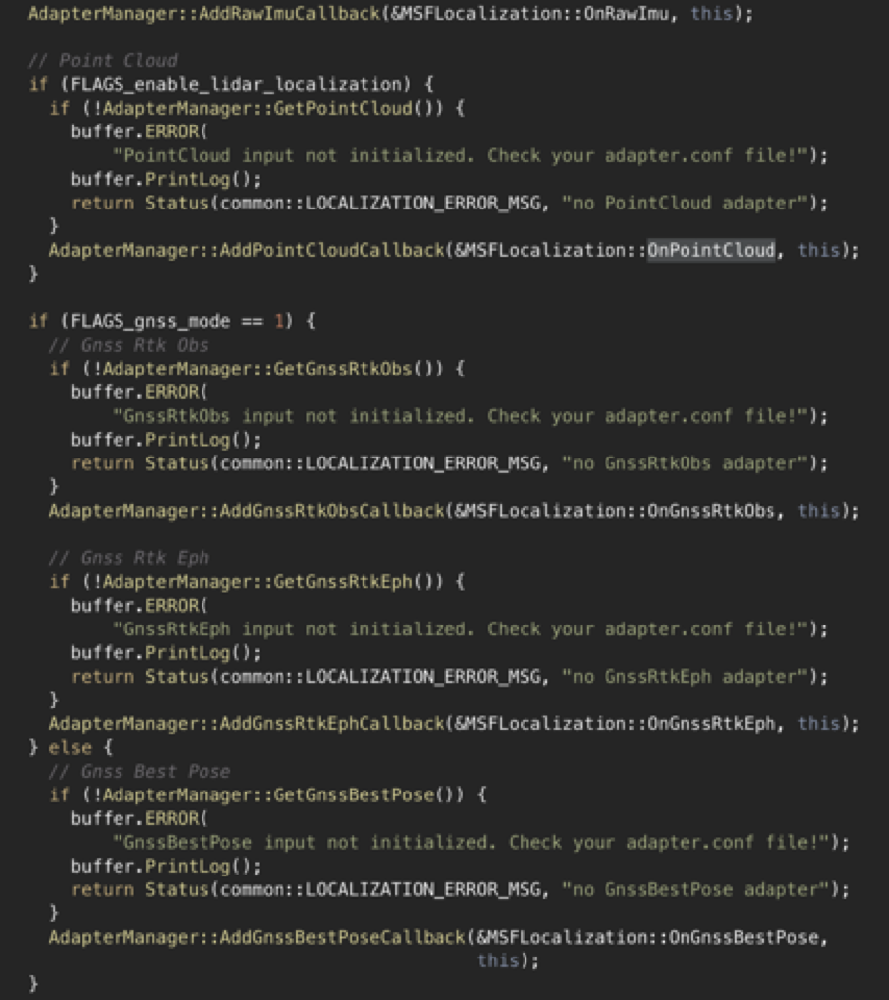

# Apollo 3.0 软件架构

自动驾驶Apollo3.0核心软件模块包括：

- **感知** — 感知模块识别自动驾驶车辆周围的世界。感知中有两个重要的子模块：障碍物检测和交通灯检测。
- **预测** — 预测模块预测感知障碍物的未来运动轨迹。
- **路由** — 路由模块告诉自动驾驶车辆如何通过一系列车道或道路到达其目的地。
- **规划** — 规划模块规划自动驾驶车辆的时间和空间轨迹。
- **控制** — 控制模块通过产生诸如油门，制动和转向的控制命令来执行规划模块产生的轨迹。
- **CanBus** — CanBus是将控制命令传递给车辆硬件的接口。它还将底盘信息传递给软件系统。
- **高精地图** — 该模块类似于库。它不是发布和订阅消息，而是经常用作查询引擎支持，以提供关于道路的特定结构化信息。
- **定位** — 定位模块利用GPS，LiDAR和IMU的各种信息源来定位自动驾驶车辆的位置。
- **HMI** — Apollo中的HMI和DreamView是一个用于查看车辆状态，测试其他模块以及实时控制车辆功能的模块.
- **监控** — 车辆中所有模块的监控系统包括硬件。
- **Guardian** — 新的安全模块，用于干预监控检测到的失败和action center相应的功能。
执行操作中心功能并进行干预的新安全模块应监控检测故障。

```
注意：下面列出了每个模块的详细信息。
```

这些模块的交互如下图所示。


每个模块都作为单独的基于CarOS的ROS节点运行。每个模块节点都发布和订阅特定topic。订阅的topic用作数据输入，而发布的topic用作数据输出。以下各节详细介绍了各模块情况。

## 感知

感知依赖LiDAR点云数据和相机原始数据。除了这些传感器数据输入之外，交通灯检测依赖定位以及HD-Map。由于实时ad-hoc交通灯检测在计算上是不可行的，因此交通灯检测需要依赖定位确定何时何地开始通过相机捕获的图像检测交通灯。
对Apollo 3.0的更改：
  - CIPV检测/尾随 - 在单个车道内移动。
  - 全线支持 - 粗线支持，可实现远程精确度。相机安装有高低两种不同的安装方式。
  - 异步传感器融合 – 因为不同传感器的帧速率差异——雷达为10ms，相机为33ms，LiDAR为100ms，所以异步融合LiDAR，雷达和相机数据，并获取所有信息并得到数据点的功能非常重要。
  - 在线姿态估计 - 在出现颠簸或斜坡时确定与估算角度变化，以确保传感器随汽车移动且角度/姿态相应地变化。
  - 视觉定位 – 基于相机的视觉定位方案正在测试中。
  - 超声波传感器 – 作为安全保障传感器，与Guardian一起用于自动紧急制动和停车。

## 预测

预测模块负责预测所有感知障碍物的未来运动轨迹。输出预测消息封装了感知信息。预测订阅定位和感知障碍物消息，如下所示。


当接收到定位更新时，预测模块更新其内部状态。当感知发出其发布感知障碍物消息时，触发预测实际执行。

## 定位

定位模块聚合各种数据以定位自动驾驶车辆。有两种类型的定位模式：OnTimer和多传感器融合。

第一种基于RTK的定位方法，通过计时器的回调函数“OnTimer”实现，如下所示。


另一种定位方法是多传感器融合（MSF）方法，其中注册了一些事件触发的回调函数，如下所示。



## 路由
为了计算可通行车道和道路，路由模块需要知道起点和终点。通常，路由起点是自动驾驶车辆位置。重要的数据接口是一个名为`OnRoutingRequest`的事件触发函数，其中`RoutingResponse`的计算和发布如下所示。


## 规划
Apollo 2.0需要使用多个信息源来规划安全无碰撞的行驶轨迹，因此规划模块几乎与其他所有模块进行交互。

首先，规划模块获得预测模块的输出。预测输出封装了原始感知障碍物，规划模块订阅交通灯检测输出而不是感知障碍物输出。
然后，规划模块获取路由输出。在某些情况下，如果当前路由结果不可执行，则规划模块还可以通过发送路由请求来触发新的路由计算。

最后，规划模块需要知道定位信息（定位：我在哪里）以及当前的自动驾驶车辆信息（底盘：我的状态是什么）。规划模块由固定频率触发，主数据接口是调用`RunOnce`函数的`OnTimer`回调函数。


底盘，定位，交通灯和预测等数据依赖关系通过`AdapterManager`类进行管理。核心软件模块同样也由`AdapterManager`类管理。例如，定位通过`AdapterManager :: GetLocalization()`管理，如下所示。


## 控制
如规划模块中所述，控制将规划轨迹作为输入，并生成控制命令传递给CanBus。它有三个主要的数据接口：OnPad，OnMonitor和OnTimer。


`OnPad`和`OnMonitor`是仿真和HMI的交互接口。 主要数据接口是`OnTimer`，它定期产生实际的控制命令，如下所示。


## CanBus

CanBus有两个数据接口。


第一个数据接口是基于计时器的发布者，回调函数为“OnTimer”。如果启用，此数据接口会定期发布底盘信息。


第二个数据接口是一个基于事件的发布者，回调函数为“OnControlCommand”，当CanBus模块接收到控制命令时会触发该函数。


## HMI
Apollo中的HMI或DreamView是一个Web应用程序：
     - 可视化自动驾驶模块的输出，例如，规划轨迹，汽车定位，底盘状态等。
     - 为用户提供人机交互界面，以查看硬件状态，打开/关闭模块，以及启动自动驾驶汽车。
     - 提供调试工具，如PnC Monitor，以有效跟踪模块问题。

## 监控
包括硬件在内的，车辆中所有模块的监控系统。监控模块从其他模块接收数据并传递给HMI，以便司机查看并确保所有模块都正常工作。如果模块或硬件发生故障，监控会向Guardian（新的操作中心模块）发送警报，然后决定需要采取哪些操作来防止系统崩溃。

## Guardian
这个新模块根据Monitor发送的数据做出相应决定。Guardian有两个主要功能：
     - 所有模块都正常工作 - Guardian允许控制模块正常工作。控制信号被发送到CANBus，就像Guardian不存在一样。
     - 监控检测到模块崩溃 - 如果监控检测到故障，Guardian将阻止控制信号到达CANBus并使汽车停止。 Guardian有三种方式决定如何停车并会依赖最终的Gatekeeper——超声波传感器，
         - 如果超声波传感器运行正常而未检测到障碍物，Guardian将使汽车缓慢停止
         - 如果传感器没有响应，Guardian会硬制动，使车马上停止。
         - 这是一种特殊情况，如果HMI通知驾驶员即将发生碰撞并且驾驶员在10秒内没有干预，Guardian会使用硬制动使汽车立即停止。

```
注意: 
1.在上述任何一种情况下，如果Monitor检测到任何模块或硬件出现故障，Guardian将始终停止该车。
2.监控器和Guardian解耦以确保没有单点故障，并且可以为Guardian模块添加其他行为且不影响监控系统，监控还与HMI通信。
```

